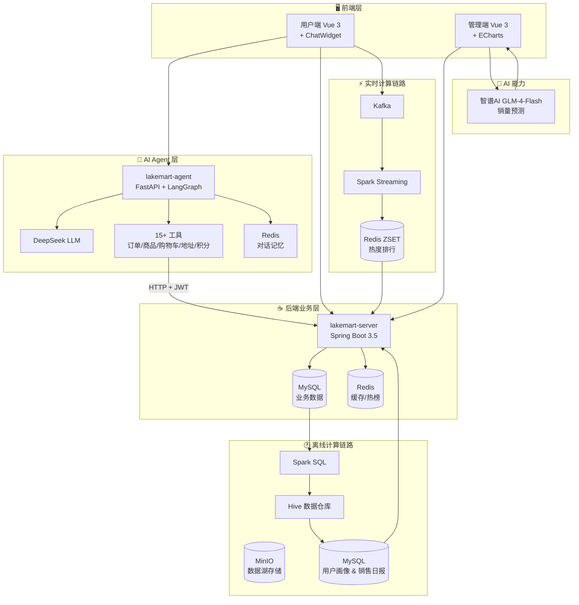
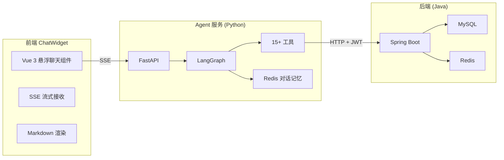
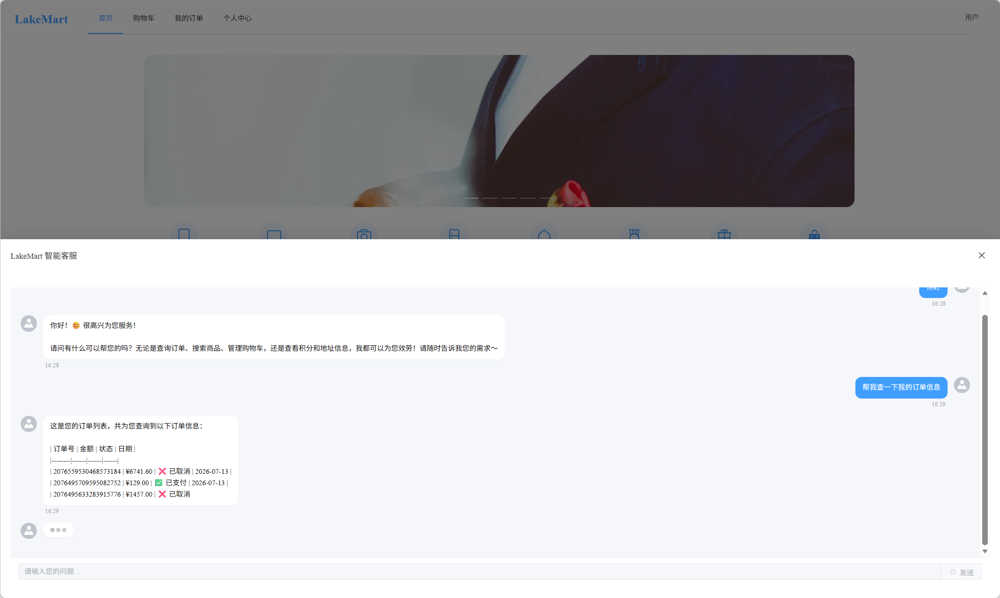
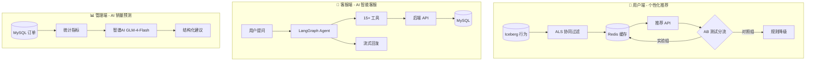

# LakeMart 电商平台

> 一个集**实时数据计算**、**用户画像分析**、**AI 智能客服**与**销量预测**于一体的湖仓一体电商数据平台。
> 不只是电商系统，更是**数据 + AI 能力的实战演练场**。

[](https://opensource.org/licenses/MIT)
[](https://spring.io/projects/spring-boot)
[](https://vuejs.org/)
[](https://python.org/)
[](https://langchain.com/langgraph)
[](https://docker.com/)

---

## 📖 项目背景

传统电商系统通常只关注交易流程，运营人员想分析数据（如"最近什么商品最火？""哪些用户是高价值客户？"）往往需要依赖数据团队写 SQL，反馈周期长。同时，用户在购物过程中遇到问题（如订单查询、商品咨询）需要等待人工客服响应，体验不佳。

本项目尝试构建一个**面向运营的数据决策平台 + 面向用户的智能客服助手**，将实时计算、离线分析、AI 对话和预测能力整合到电商系统中，让运营人员能直接看到数据洞察，让用户能获得即时、准确的客服支持。

**核心解决的问题：**
- 实时监控商品热度（埋点 → Kafka → Spark Streaming）
- 自动生成用户画像（RFM 分层 + 类目偏好）
- 用 AI 辅助预测销量趋势，给出库存建议
- 用 AI 智能客服即时响应用户咨询，覆盖订单查询、商品搜索、购物车管理等高频场景

---

## 🎯 项目亮点

| 亮点 | 技术实现 | 效果 |
|:---|:---|:---|
| **实时热度排行** | 埋点日志 → Kafka → Spark Streaming 滑动窗口（5分钟） | Top10 商品热度实时更新 |
| **用户画像与销售日报** | Spark SQL 每日处理 Parquet 订单日志 | 自动计算 RFM 分层与类目偏好 |
| **AI 销量预测与建议** | 智谱AI GLM-4-Flash + 三种预测算法 | 输出趋势判断 + 补货数量 + 促销策略 |
| **AI 智能客服** | LangGraph 1.2 + DeepSeek + 15+ 工具 | 7×24 小时即时响应用户咨询 |
| **高并发接口** | Redis 缓存商品详情 | 接口响应 ≤ 50ms |
| **一键部署** | Docker Compose 编排 8 个服务 | 开箱即用 |
| **个性化推荐** | ALS 协同过滤 + 时间衰减 + AB 测试（10%流量） | 推荐列表点击率可量化验证 |

---

## 📐 系统架构与数据流向



---

## 🤖 AI 智能客服（新增）

> **解决什么问题**：用户在购物过程中遇到问题（订单查询、商品咨询、购物车管理），无需等待人工客服，AI 助手即时响应。

### 技术架构



### 支持的工具（15+）

| 分类 | 工具 | 说明 |
|:---|:---|:---|
| **订单** | `list_my_orders` | 查看所有订单 |
| | `query_order_status` | 查询特定订单详情 |
| | `cancel_order` | 取消订单（需用户确认） |
| | `pay_order` | 支付订单（需用户确认） |
| **商品** | `search_products` | 搜索商品 |
| | `get_product_detail` | 查看商品详情 |
| **用户** | `get_user_profile` | 查看个人信息 |
| | `get_user_statistics` | 查看消费统计 |
| | `get_points_logs` | 查看积分记录 |
| **购物车** | `get_cart_list` | 查看购物车 |
| | `add_to_cart` | 添加商品到购物车 |
| | `remove_from_cart` | 从购物车移除商品 |
| | `clear_cart` | 清空购物车（需用户确认） |
| **地址** | `get_address_list` | 查看所有收货地址 |
| | `get_default_address` | 查看默认地址 |

---

## 📸 核心功能截图

| 数据仪表盘 | AI 销量预测 |
|:---:|:---:|
|  |  |

|         用户端首页          | AI 智能客服 |
|:---------------------------:|:---:|
|  |  |

| 管理端商品管理 | 用户端购物车 |
|:---:|:---:|
|  |  |

---

## 📊 大数据分析仪表盘（管理端核心能力）

> 覆盖从**数据展示 → 用户洞察 → 实时监控 → AI决策**的完整链路。

| 模块 | 说明 | 图表类型 |
|:---|:---|:---|
| **核心指标卡片** | 总订单数、总销售额、总用户数、热销商品数 | 实时刷新卡片 |
| **订单趋势** | 按日统计订单量，支持日期范围筛选 | 折线图 + 下钻 |
| **销售额趋势** | 按日统计销售金额 | 面积图 |
| **热销商品 TOP 10** | 基于近30天订单销量排行 | 柱状图 + 下钻 |
| **实时行为趋势** | 最近60分钟内用户行为聚合 | 折线图 + 实时开关 |
| **用户行为分布** | 过去30天用户行为占比 | 饼图 |
| **用户购买路径漏斗** | 浏览→加购→下单→支付的转化率 | 漏斗图 |
| **RFM 用户分层** | 高价值/忠诚/流失等8类用户 | 饼图 + 表格 + 下钻 |
| **商品销量预测** | 3种算法 + AI 库存建议 | 折线图 + AI 分析卡片 |

---

## 🤖 智能算法与 AI 能力

LakeMart 在 **用户端**、**管理端** 和 **客服端** 分别落地了三种不同类型的 AI 能力。



---

### 一、用户端：个性化推荐算法（ALS 协同过滤 + 时间衰减 + AB 测试）

> **解决什么问题**：让每个用户看到自己可能感兴趣的商品，提升点击率和购买转化。

| 算法模块 | 技术选型 | 核心参数 | 业务价值 |
|:---|:---|:---|:---|
| **ALS 协同过滤** | Spark MLlib 3.5.0 | Rank=30, RegParam=0.5, MaxIter=10 | 挖掘"用户-商品"隐性偏好，发现长尾商品 |
| **时间衰减** | 指数衰减 `e^(-λ·Δt)` | λ=0.1，半衰期约 7 天 | 近 7 天行为权重 > 50%，捕捉兴趣漂移 |
| **AB 测试框架** | 哈希分流 + 行为埋点 | 实验组流量 10%（可配置） | 科学对比算法效果，支撑全量上线决策 |
| **降级策略** | 品类偏好 → 相似商品 → 热销兜底 | 三级降级，保障 100% 可用性 | 冷启动/缓存未命中时保证推荐质量 |

---

### 二、客服端：AI 智能客服（LangGraph + DeepSeek）

> **解决什么问题**：7×24 小时即时响应用户咨询，覆盖订单查询、商品搜索、购物车管理等高频场景。

| 模块 | 技术选型 | 说明 |
|:---|:---|:---|
| **Agent 框架** | LangGraph 1.2 | 状态图编排，支持多轮对话 |
| **LLM** | DeepSeek Chat | 高性价比，推理能力强 |
| **工具系统** | 15+ 业务工具 | 订单/商品/购物车/地址/积分 |
| **对话记忆** | Redis | 持久化存储，支持会话恢复 |
| **流式输出** | SSE | 打字机效果，提升用户体验 |

**核心流程**：
1. 用户通过前端 ChatWidget 发送问题
2. Agent 识别意图，选择合适的工具
3. 工具通过 HTTP + JWT 调用后端 API 获取数据
4. Agent 整理结果，通过 SSE 流式返回给用户

---

### 三、管理端：AI 销量预测与智能库存建议

> **解决什么问题**：帮助运营人员预判商品销量趋势，降低库存积压风险，制定促销策略。

1. **数据输入**：用户选择历史天数（30/60/90）和预测天数（7/14/30）
2. **统计计算**：后端从 MySQL 订单表计算指定时间范围内的销量总量、日均、峰值、趋势斜率
3. **AI 推理**：将统计数据通过结构化 Prompt 输入智谱AI GLM-4-Flash
4. **结构化输出**：AI 返回 JSON 格式建议，前端直接渲染

---

### 算法能力对比

| 指标 | 用户端推荐（ALS） | 客服端 Agent（LangGraph） | 管理端预测（AI） |
|:---|:---:|:---:|:---:|
| **技术类型** | 协同过滤 + 矩阵分解 | 大语言模型 + 工具调用 | 大语言模型 + 统计趋势 |
| **数据来源** | Iceberg 用户行为表 | MySQL（通过后端 API） | MySQL 订单表 |
| **更新频率** | 每日凌晨离线训练 | 实时（用户触发） | 实时（用户触发） |
| **核心价值** | 提升点击率和转化率 | 降低客服成本，即时响应 | 辅助库存决策，降低积压风险 |
| **当前状态** | ✅ 已上线（AB 测试中） | ✅ 已上线 | ✅ 已上线 |

---

## 🛠 技术栈

| 层级 | 技术选型 |
|:---|:---|
| **后端框架** | Spring Boot 3.5.13 / JDK 21 / MyBatis-Plus |
| **数据库** | MySQL 8 / Redis 7 |
| **大数据** | Kafka / Spark Streaming / Spark SQL / MinIO / Iceberg |
| **AI Agent** | Python 3.12 / FastAPI / LangGraph 1.2 / LangChain 1.2 |
| **LLM** | DeepSeek Chat / 智谱AI GLM-4-Flash |
| **前端** | Vue 3 / TypeScript / Element Plus / ECharts / Pinia |
| **部署** | Docker / Docker Compose |

---

## ✨ 完整功能列表

<details>
<summary>点击展开（管理端 + 用户端 + AI 客服）</summary>

**管理端**
- 登录 / 退出（JWT，角色区分）
- 商品管理（CRUD、上下架、MinIO 图片上传）
- 订单管理（列表、状态筛选、发货、完成、取消、Excel 导出）
- 用户管理（列表、禁用/启用、重置密码、积分调整、Excel 导出）
- 分类管理（树形结构、增删改查、状态切换）
- 轮播图管理（CRUD、图片上传、启用/禁用）
- 数据仪表盘（订单趋势、销售额趋势、热销商品排行、RFM分层、漏斗图、实时行为）
- 个人中心（修改密码、头像上传、手机号、邮箱修改）
- 图表交互下钻（点击图表查看详情）

**用户端**
- 注册 / 登录（邮箱验证码）
- 商品浏览（三级分类级联筛选、关键词搜索、价格/销量排序）
- 商品详情
- 购物车（添加、修改数量、删除、清空）
- 收货地址管理（增删改查、设为默认）
- 下单（从购物车选择商品、选择地址、生成订单）
- 订单管理（列表、状态筛选、模拟支付、取消订单、确认收货）
- 积分明细
- 个人中心
- **AI 智能客服**（全局悬浮窗口、流式对话、Markdown 渲染）

</details>

---

## 🚀 快速开始（Docker）

```bash
git clone https://github.com/sunkuizhi/LakeMart.git
cd LakeMart

# 配置环境变量（DeepSeek API Key）
cp .env.example .env
# 编辑 .env 填入 DEEPSEEK_API_KEY

# 一键启动所有服务
docker-compose up -d
```

| 服务 | 地址 |
|:---|:---|
| 用户端 | http://localhost:5173 |
| 管理端 | http://localhost:5174 |
| Agent 健康检查 | http://localhost:8081/health |
| MinIO 控制台 | http://localhost:9001（minioadmin / minioadmin） |

**默认账号**：`admin@qq.com` / `12345678`

> 所有服务数据通过 Docker 卷持久化，重启不丢失。

---

## 💻 本地开发运行

### 后端（IDEA）
1. 安装 JDK 21、Maven、MySQL、Redis、MinIO
2. 导入 `lakemart-server` 模块
3. 修改 `application.yml` 中的数据库、Redis、MinIO 地址
4. 运行 `LakeMartApplication.main()`

### AI Agent（PyCharm / VS Code）
1. 安装 Python 3.12、Conda（可选）
2. 进入 `lakemart-agent` 目录
3. 创建虚拟环境并安装依赖：
   ```bash
   python -m venv .venv
   source .venv/bin/activate  # Windows: .venv\Scripts\activate
   pip install -e .
   ```
4. 配置 `.env` 文件（复制 `.env.example`）
5. 启动服务：
   ```bash
   uvicorn src.lakemart_agent.main:app --reload --host 0.0.0.0 --port 8081
   ```

### 前端（VS Code）
```bash
cd lakemart-client && npm install && npm run dev
cd lakemart-admin && npm install && npm run dev
```

### Spark 大数据模块（IDEA）
1. 安装 JDK 17（必须，Spark 3.5 不兼容 JDK 21）
2. 确认 Docker 服务（MinIO、Kafka）已启动
3. 运行 `lakemart-spark` 中对应批处理作业的 main 方法
4. 定时调度：`SparkBatchScheduler` 集成 Spring `@Scheduled`，无需手动触发

---

## 📁 项目结构

```
LakeMart/
├── docker-compose.yml              # 一键部署（8 个服务）
├── .env.example                    # 环境变量模板
├── lakemart-server/                # Spring Boot 后端
│   └── Dockerfile
├── lakemart-agent/                 # AI 智能客服（Python + LangGraph）
│   ├── Dockerfile
│   ├── pyproject.toml
│   └── src/lakemart_agent/
├── lakemart-admin/                 # 管理端（Vue 3 + ECharts）
│   └── Dockerfile
├── lakemart-client/                # 用户端（Vue 3 + ChatWidget）
│   └── Dockerfile
├── lakemart-spark/                 # Spark 批处理（可选）
└── sql/                            # 建表脚本
```

---

## 🔧 环境变量配置

| 变量名 | 说明 | 默认值 |
|:---|:---|:---|
| `DEEPSEEK_API_KEY` | DeepSeek API Key（Agent 必需） | 无（必须设置） |
| `DEEPSEEK_MODEL` | DeepSeek 模型名称 | deepseek-chat |
| `ZHIPUAI_API_KEY` | 智谱AI API Key（销量预测） | 无（必须设置） |
| `DB_PASSWORD` | MySQL 密码 | root |
| `JWT_SECRET` | JWT 密钥 | 需修改 |

详见 `.env.example`。

---

## 📸 全部截图

<details>
<summary>点击展开管理端截图</summary>

| 功能 | 截图 |
|:---|:---|
| 仪表盘-销售趋势 |  |
| 仪表盘-商品分析 |  |
| 仪表盘-用户分析 |  |
| 仪表盘-实时监控 |  |
| AI销量预测 |  |
| 商品管理 |  |
| 分类管理 |  |
| 订单管理 |  |
| 用户管理 |  |

</details>

<details>
<summary>点击展开用户端截图</summary>

| 功能 | 截图 |
|:---|:---|
| 首页 |  |
| 购物车 |  |
| 我的订单 |  |
| 个人中心 |  |
| AI 智能客服 |  |

</details>

---

## 🎉 最新更新（2026-08-03）
- ✅ **新增 AI 智能客服模块**：基于 LangGraph 1.2 + DeepSeek，支持 15+ 业务工具，7×24 即时响应
- ✅ **前端全局悬浮聊天组件**：SSE 流式输出，Markdown 渲染，打字机效果
- ✅ **Docker 一键部署**：整合 Agent 服务到 Docker Compose，开箱即用
- ✅ 推荐参数调优：网格搜索 20 种组合，最优 Rank=30 / RegParam=0.5

---

## 🤝 贡献指南

欢迎提交 Issue 和 Pull Request。

---

## 📄 许可证

MIT License © 2026 [sunkuizhi](https://github.com/sunkuizhi)

---
