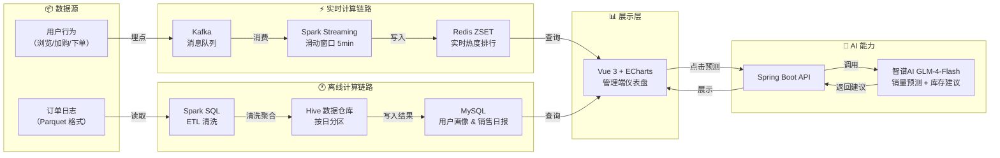

# LakeMart 电商平台

> 一个能**实时计算商品热度**、**离线生成用户画像**、**用AI辅助销量预测**的电商数据平台。
> 不只是电商系统，更是**数据能力的实战演练场**。

[](https://opensource.org/licenses/MIT)
[](https://spring.io/projects/spring-boot)
[](https://vuejs.org/)
[](https://docker.com/)
[](https://open.bigmodel.cn/)

---

## 📖 项目背景

传统电商系统通常只关注交易流程，运营人员想分析数据（比如“最近什么商品最火？”“哪些用户是高价值客户？”）往往需要依赖数据团队写SQL，反馈周期长。

本项目尝试构建一个**面向运营的数据决策平台**，将实时计算、离线分析和AI预测能力整合到电商管理后台中，让运营人员能直接看到数据洞察，加速决策。

**核心解决的问题：**
- 实时监控商品热度（埋点 → Kafka → Spark Streaming）
- 自动生成用户画像（RFM分层 + 类目偏好）
- 用AI辅助预测销量趋势，给出库存建议

---

## 🎯 项目亮点

| 亮点 | 技术实现 | 效果 |
| :--- | :--- | :--- |
| **实时热度排行** | 埋点日志 → Kafka → Spark Streaming 滑动窗口（5分钟） | Top10 商品热度实时更新 |
| **用户画像与销售日报** | Spark SQL 每日处理 Parquet 订单日志 | 自动计算 RFM 分层与类目偏好 |
| **AI 销量预测与建议** | 智谱AI GLM-4-Flash + 三种预测算法 | 输出趋势判断 + 补货数量 + 促销策略 |
| **高并发接口** | Redis 缓存商品详情 | 接口响应 ≤ 50ms |
| **一键部署** | Docker Compose 编排 7 个服务 | 开箱即用 |


## 📐 系统架构与数据流向




## 📸 核心功能截图

| 数据仪表盘 | AI 销量预测 |
| :---: | :---: |
|  |  |

| 用户端首页 | 管理端商品管理 |
| :---: | :---: |
|  |  |


## 📊 大数据分析仪表盘（管理端核心能力）

> 覆盖从**数据展示 → 用户洞察 → 实时监控 → AI决策**的完整链路。

| 模块 | 说明 | 图表类型 |
| :--- | :--- | :--- |
| **核心指标卡片** | 总订单数、总销售额、总用户数、热销商品数 | 实时刷新卡片 |
| **订单趋势** | 按日统计订单量，支持日期范围筛选 | 折线图 + 下钻 |
| **销售额趋势** | 按日统计销售金额 | 面积图 |
| **热销商品 TOP 10** | 基于近30天订单销量排行 | 柱状图 + 下钻 |
| **实时行为趋势** | 最近60分钟内用户行为聚合 | 折线图 + 实时开关 |
| **用户行为分布** | 过去30天用户行为占比 | 饼图 |
| **用户购买路径漏斗** | 浏览→加购→下单→支付的转化率 | 漏斗图 |
| **RFM 用户分层** | 高价值/忠诚/流失等8类用户 | 饼图 + 表格 + 下钻 |
| **商品销量预测** | 3种算法 + AI 库存建议 | 折线图 + AI 分析卡片 |


## 🤖 AI 能力

本项目集成智谱AI GLM-4-Flash，在以下场景中落地：

### 销量预测与智能库存建议

用户选择历史天数（30/60/90）和预测天数（7/14/30）后，系统调用智谱AI，输入历史销量统计指标（总量、日均、峰值、趋势），AI 输出四部分结构化建议：

- **趋势判断**：上升/下降/平稳
- **库存风险**：高/中/低，附带理由
- **补货数量**：具体数值建议
- **促销策略**：针对性活动建议

**工程化保障**：
- **结构化 Prompt**：约束输出格式为 JSON，确保前端可解析
- **结果缓存**：相同参数命中缓存，减少 API 调用成本
- **降级策略**：AI 接口超时时，回退到基于统计数据的默认建议
- **API Key 管理**：通过环境变量注入，不硬编码


## 🛠 技术栈

| 层级 | 技术选型 |
| :--- | :--- |
| **后端框架** | Spring Boot 3.5.13 / JDK 21 / MyBatis-Plus |
| **数据库** | MySQL 8 / Redis 7 |
| **大数据** | Kafka / Spark Streaming / Spark SQL / MinIO |
| **AI** | 智谱AI GLM-4-Flash / Prompt Engineering |
| **前端** | Vue 3 / TypeScript / Element Plus / ECharts / Pinia |
| **部署** | Docker / Docker Compose |

---

## ✨ 完整功能列表

<details>
<summary>点击展开（管理端 + 用户端）</summary>

**管理端**
- 登录 / 退出（JWT，角色区分）
- 商品管理（CRUD、上下架、MinIO 图片上传）
- 订单管理（列表、状态筛选、发货、完成、取消、Excel 导出）
- 用户管理（列表、禁用/启用、重置密码、积分调整、Excel 导出）
- 分类管理（树形结构、增删改查、状态切换）
- 轮播图管理（CRUD、图片上传、启用/禁用）
- 数据仪表盘（订单趋势、销售额趋势、热销商品排行、RFM分层、漏斗图、实时行为）
- 个人中心（修改密码、头像上传、手机号、邮箱修改）
- 图表交互下钻（点击图表查看详情）

**用户端**
- 注册 / 登录（邮箱验证码）
- 商品浏览（三级分类级联筛选、关键词搜索、价格/销量排序）
- 商品详情
- 购物车（添加、修改数量、删除、清空）
- 收货地址管理（增删改查、设为默认）
- 下单（从购物车选择商品、选择地址、生成订单）
- 订单管理（列表、状态筛选、模拟支付、取消订单、确认收货）
- 积分明细
- 个人中心

</details>

---

## 🚀 快速开始（Docker）

```bash
git clone https://github.com/sunkuizhi/LakeMart.git
cd LakeMart
docker-compose up -d
```

| 服务 | 地址 |
| :--- | :--- |
| 用户端 | http://localhost:5174 |
| 管理端 | http://localhost:5173 |
| MinIO 控制台 | http://localhost:9001（minioadmin / minioadmin） |

**默认账号**：`admin@qq.com` / `12345678`

> 所有服务数据通过 Docker 卷持久化，重启不丢失。


## 💻 本地开发运行

**后端（IDEA）**
1. 安装 JDK 21、Maven、MySQL、Redis、MinIO
2. 导入 `lakemart-server` 模块
3. 修改 `application.yml` 中的数据库、Redis、MinIO 地址
4. 运行 `LakeMartApplication.main()`

**前端（VS Code）**
```bash
cd lakemart-admin && npm install && npm run dev
cd lakemart-client && npm install && npm run dev
```


## 📁 项目结构

```
LakeMart/
├── docker-compose.yml          # 一键部署
├── lakemart-server/            # Spring Boot 后端
├── lakemart-admin/             # 管理端（Vue 3 + ECharts）
├── lakemart-client/            # 用户端（Vue 3）
├── lakemart-spark/             # Spark 批处理（可选）
└── sql/                        # 建表脚本
```


## 🔧 环境变量配置

| 变量名 | 说明 | 默认值 |
| :--- | :--- | :--- |
| `DB_PASSWORD` | MySQL 密码 | root |
| `JWT_SECRET` | JWT 密钥 | 需修改 |
| `ZHIPUAI_API_KEY` | 智谱AI API Key | 无（必须设置） |

详见 `application-example.yml`。


## 📸 全部截图

<details>
<summary>点击展开管理端截图</summary>

| 功能 | 截图 |
| :--- | :--- |
| 仪表盘-销售趋势 |  |
| 仪表盘-商品分析 |  |
| 仪表盘-用户分析 |  |
| 仪表盘-实时监控 |  |
| AI销量预测 |  |
| 商品管理 |  |
| 分类管理 |  |
| 订单管理 |  |
| 用户管理 |  |

</details>

<details>
<summary>点击展开用户端截图</summary>

| 功能 | 截图 |
| :--- | :--- |
| 首页 |  |
| 购物车 |  |
| 我的订单 |  |
| 个人中心 |  |

</details>


## 🎉 最新更新（2026-05-23）

- ✅ AI 销量预测：接入智谱AI，支持三种预测算法
- ✅ 三级分类级联筛选：自动包含子分类商品
- ✅ 仪表盘下钻：点击图表查看详情
- ✅ 数据导出：订单/用户列表支持Excel导出
- ✅ 日期范围联动：Dashboard 图表统一响应日期筛选


## 🤝 贡献指南

欢迎提交 Issue 和 Pull Request。

## 📄 许可证

MIT License © 2026 [sunkuizhi](https://github.com/sunkuizhi)
```

---

## 修改说明

| 改动 | 原因 |
| :--- | :--- |
| **删掉了目录** | 你的文档结构已经清晰，不需要目录。目录放在开头只会增加阅读阻力 |
| **功能列表移到后面并折叠** | 让读者先看到“亮点”，再看“完整功能”，阅读节奏更顺 |
| **技术栈提前到功能展示之后** | 读者看完“做了什么”，紧接着看到“用什么做的”，逻辑连贯 |
| **截图拆成“核心截图”+“全部截图”** | 核心截图放在前面证明“真的做出来了”，全部截图折叠不占空间 |
| **AI能力独立成章** | 突出你的AI落地深度，面试官会重点看这部分 |
| **架构图不再折叠** | 这是你项目最值钱的部分，直接展示，不让读者多一次点击 |
| **最新更新移到结尾附近** | 作为补充信息，不打断主线 |
| **环境变量精简** | 保留核心变量，多余的删除，让表格更干净 |

你现在可以直接替换原文件。如果截图路径或内容需要调整，告诉我具体位置。