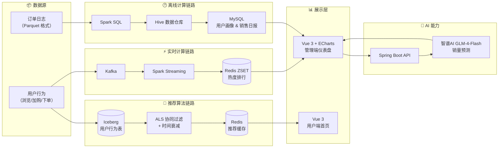
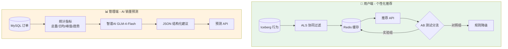

# LakeMart 电商平台

> 一个能**实时计算商品热度**、**离线生成用户画像**、**用AI辅助销量预测**的电商数据平台。
> 不只是电商系统，更是**数据能力的实战演练场**。

[](https://opensource.org/licenses/MIT)
[](https://spring.io/projects/spring-boot)
[](https://vuejs.org/)
[](https://docker.com/)
[](https://open.bigmodel.cn/)

---

## 📖 项目背景

传统电商系统通常只关注交易流程，运营人员想分析数据（如"最近什么商品最火？""哪些用户是高价值客户？"）往往需要依赖数据团队写 SQL，反馈周期长。

本项目尝试构建一个**面向运营的数据决策平台**，将实时计算、离线分析和AI预测能力整合到电商管理后台中，让运营人员能直接看到数据洞察，加速决策。

**核心解决的问题：**
- 实时监控商品热度（埋点 → Kafka → Spark Streaming）
- 自动生成用户画像（RFM分层 + 类目偏好）
- 用AI辅助预测销量趋势，给出库存建议

---

## 🎯 项目亮点

| 亮点             | 技术实现                                     | 效果 |
|:---------------|:-----------------------------------------| :--- |
| **实时热度排行**     | 埋点日志 → Kafka → Spark Streaming 滑动窗口（5分钟） | Top10 商品热度实时更新 |
| **用户画像与销售日报**  | Spark SQL 每日处理 Parquet 订单日志              | 自动计算 RFM 分层与类目偏好 |
| **AI 销量预测与建议** | 智谱AI GLM-4-Flash + 三种预测算法                | 输出趋势判断 + 补货数量 + 促销策略 |
| **高并发接口**      | Redis 缓存商品详情                             | 接口响应 ≤ 50ms |
| **一键部署**       | Docker Compose 编排 7 个服务                  | 开箱即用 |
| **个性化推荐**     | ALS 协同过滤 + 时间衰减 + AB 测试（10%流量）   | 推荐列表点击率提升可量化验证 |


## 📐 系统架构与数据流向





## 📸 核心功能截图

| 数据仪表盘 | AI 销量预测 |
| :---: | :---: |
|  |  |

| 用户端首页 | 管理端商品管理 |
| :---: | :---: |
|  |  |


## 📊 大数据分析仪表盘（管理端核心能力）

> 覆盖从**数据展示 → 用户洞察 → 实时监控 → AI决策**的完整链路。

| 模块 | 说明 | 图表类型 |
| :--- | :--- | :--- |
| **核心指标卡片** | 总订单数、总销售额、总用户数、热销商品数 | 实时刷新卡片 |
| **订单趋势** | 按日统计订单量，支持日期范围筛选 | 折线图 + 下钻 |
| **销售额趋势** | 按日统计销售金额 | 面积图 |
| **热销商品 TOP 10** | 基于近30天订单销量排行 | 柱状图 + 下钻 |
| **实时行为趋势** | 最近60分钟内用户行为聚合 | 折线图 + 实时开关 |
| **用户行为分布** | 过去30天用户行为占比 | 饼图 |
| **用户购买路径漏斗** | 浏览→加购→下单→支付的转化率 | 漏斗图 |
| **RFM 用户分层** | 高价值/忠诚/流失等8类用户 | 饼图 + 表格 + 下钻 |
| **商品销量预测** | 3种算法 + AI 库存建议 | 折线图 + AI 分析卡片 |

---

## 🤖 智能算法与 AI 能力

LakeMart 在 **用户端** 和 **管理端** 分别落地了两种不同类型的算法，覆盖“个性化推荐”与“运营决策辅助”两大场景。



---

### 一、用户端：个性化推荐算法（ALS 协同过滤 + 时间衰减 + AB 测试）

> **解决什么问题**：让每个用户看到自己可能感兴趣的商品，提升点击率和购买转化。

| 算法模块 | 技术选型 | 核心参数 | 业务价值 |
| :--- | :--- | :--- | :--- |
| **ALS 协同过滤** | Spark MLlib 3.5.0 | Rank=30, RegParam=0.5, MaxIter=10 | 挖掘“用户-商品”隐性偏好，发现长尾商品 |
| **时间衰减** | 指数衰减 `e^(-λ·Δt)` | λ=0.1，半衰期约 7 天 | 近 7 天行为权重 > 50%，捕捉兴趣漂移 |
| **AB 测试框架** | 哈希分流 + 行为埋点 | 实验组流量 10%（可配置） | 科学对比算法效果，支撑全量上线决策 |
| **降级策略** | 品类偏好 → 相似商品 → 热销兜底 | 三级降级，保障 100% 可用性 | 冷启动/缓存未命中时保证推荐质量 |

#### ① ALS 协同过滤

**核心原理**：将用户对商品的评分矩阵 `R` 分解为两个低维矩阵的乘积：`R ≈ U × Vᵀ`。通过交替最小二乘法优化，挖掘用户和商品在隐因子空间中的特征向量。

**在 LakeMart 中的落地**：
- 行为映射：浏览=1、加购=3、购买=5
- 每日凌晨离线训练，为所有活跃用户生成 Top-20 推荐列表存入 Redis
- 用户端首页“猜你喜欢”区块实时读取

```scala
// 训练核心代码（UserRecommendBatch.scala）
val als = new ALS()
  .setRank(30)
  .setRegParam(0.5)
  .setMaxIter(10)
  .setUserCol("user_id")
  .setItemCol("product_id")
  .setRatingCol("rating")

val model = als.fit(ratingDF)
val recommendations = model.recommendForUserSubset(users, 20)
```

#### ② 实时权重衰减

**核心公式**：`weight(t) = base_weight × e^(-0.1 × Δt)`

| 行为类型 | 今天发生 | 7 天前 | 30 天前 |
| :--- | :---: | :---: | :---: |
| 浏览 | 1.00 | 0.50 | 0.05 |
| 加购 | 3.00 | 1.50 | 0.15 |
| 购买 | 5.00 | 2.50 | 0.25 |

*一个 30 天前的购买行为，权重仅为今天浏览行为的 5%*，有效过滤历史噪音。

#### ③ AB 测试框架

**分流逻辑**：基于 `userId.hashCode() % 100` 稳定分流，默认 10% 用户进入 ALS 实验组。

**效果对比 SQL**（积累数据后分析）：
```sql
SELECT 
    experiment_id,
    COUNT(DISTINCT user_id) AS uv,
    COUNT(CASE WHEN action='BUY' THEN 1 END) / COUNT(DISTINCT user_id) AS conversion_rate
FROM user_behavior_log
WHERE experiment_id IS NOT NULL
GROUP BY experiment_id;
```

**降级策略**：Redis 缓存命中 → 用户偏好品类 → 相似商品 → 热销兜底，接口可用性 ≥ 99.9%。

---

### 二、管理端：AI 销量预测与智能库存建议

> **解决什么问题**：帮助运营人员预判商品销量趋势，降低库存积压风险，制定促销策略。

#### 技术实现

1. **数据输入**：用户选择历史天数（30/60/90）和预测天数（7/14/30）
2. **统计计算**：后端从 MySQL 订单表计算指定时间范围内的销量总量、日均、峰值、趋势斜率
3. **AI 推理**：将统计数据通过结构化 Prompt 输入智谱AI GLM-4-Flash
4. **结构化输出**：AI 返回 JSON 格式建议，前端直接渲染

```
输入示例（Prompt）：
"历史30天销量数据：总量 12,847 件，日均 428 件，峰值 1,203 件，趋势上升（斜率 2.3）。请预测未来 7 天销量并给出库存建议。"

输出示例（JSON）：
{
  "trend": "上升",
  "risk_level": "中",
  "suggested_stock": 3500,
  "promotion_strategy": "建议搭配组合促销，清理低频 SKU"
}
```

#### 工程化保障
- **结构化 Prompt**：约束输出为 JSON，前端可直接解析
- **结果缓存**：相同参数命中缓存（1 小时），减少 API 调用成本
- **降级策略**：AI 接口超时时，基于统计指标返回保守建议（移动平均预测）
- **API Key 管理**：通过环境变量 `ZHIPUAI_API_KEY` 注入

---

### 算法效果对比

| 指标 | 用户端推荐（ALS） | 管理端预测（AI） |
| :--- | :---: | :---: |
| **技术类型** | 协同过滤 + 矩阵分解 | 大语言模型 + 统计趋势 |
| **数据来源** | Iceberg 用户行为表 | MySQL 订单表 |
| **更新频率** | 每日凌晨离线训练 | 实时（用户触发） |
| **核心价值** | 提升点击率和转化率 | 辅助库存决策，降低积压风险 |
| **当前状态** | ✅ 已上线（AB 测试中） | ✅ 已上线 |


---

## 🛠 技术栈

| 层级 | 技术选型 |
| :--- | :--- |
| **后端框架** | Spring Boot 3.5.13 / JDK 21 / MyBatis-Plus |
| **数据库** | MySQL 8 / Redis 7 |
| **大数据** | Kafka / Spark Streaming / Spark SQL / MinIO |
| **AI** | 智谱AI GLM-4-Flash / Prompt Engineering |
| **前端** | Vue 3 / TypeScript / Element Plus / ECharts / Pinia |
| **部署** | Docker / Docker Compose |

---

## ✨ 完整功能列表

<details>
<summary>点击展开（管理端 + 用户端）</summary>

**管理端**
- 登录 / 退出（JWT，角色区分）
- 商品管理（CRUD、上下架、MinIO 图片上传）
- 订单管理（列表、状态筛选、发货、完成、取消、Excel 导出）
- 用户管理（列表、禁用/启用、重置密码、积分调整、Excel 导出）
- 分类管理（树形结构、增删改查、状态切换）
- 轮播图管理（CRUD、图片上传、启用/禁用）
- 数据仪表盘（订单趋势、销售额趋势、热销商品排行、RFM分层、漏斗图、实时行为）
- 个人中心（修改密码、头像上传、手机号、邮箱修改）
- 图表交互下钻（点击图表查看详情）

**用户端**
- 注册 / 登录（邮箱验证码）
- 商品浏览（三级分类级联筛选、关键词搜索、价格/销量排序）
- 商品详情
- 购物车（添加、修改数量、删除、清空）
- 收货地址管理（增删改查、设为默认）
- 下单（从购物车选择商品、选择地址、生成订单）
- 订单管理（列表、状态筛选、模拟支付、取消订单、确认收货）
- 积分明细
- 个人中心

</details>

---

## 🚀 快速开始（Docker）

```bash
git clone https://github.com/sunkuizhi/LakeMart.git
cd LakeMart
docker-compose up -d
```

| 服务 | 地址 |
| :--- | :--- |
| 用户端 | http://localhost:5174 |
| 管理端 | http://localhost:5173 |
| MinIO 控制台 | http://localhost:9001（minioadmin / minioadmin） |

**默认账号**：`admin@qq.com` / `12345678`

> 所有服务数据通过 Docker 卷持久化，重启不丢失。


## 💻 本地开发运行

**后端（IDEA）**
1. 安装 JDK 21、Maven、MySQL、Redis、MinIO
2. 导入 `lakemart-server` 模块
3. 修改 `application.yml` 中的数据库、Redis、MinIO 地址
4. 运行 `LakeMartApplication.main()`

**前端（VS Code）**
```bash
cd lakemart-admin && npm install && npm run dev
cd lakemart-client && npm install && npm run dev
```

**Spark 大数据模块（IDEA）**
1. 安装 JDK 17（必须，Spark 3.5 不兼容 JDK 21）
2. 确认 Docker 服务（MinIO、Kafka）已启动
3. 运行 `lakemart-spark` 中对应批处理作业的 main 方法
4. 定时调度：`SparkBatchScheduler` 集成 Spring `@Scheduled`，无需手动触发


## 📁 项目结构

```
LakeMart/
├── docker-compose.yml          # 一键部署
├── lakemart-server/            # Spring Boot 后端
├── lakemart-admin/             # 管理端（Vue 3 + ECharts）
├── lakemart-client/            # 用户端（Vue 3）
├── lakemart-spark/             # Spark 批处理（可选）
└── sql/                        # 建表脚本
```


## 🔧 环境变量配置

| 变量名 | 说明 | 默认值 |
| :--- | :--- | :--- |
| `DB_PASSWORD` | MySQL 密码 | root |
| `JWT_SECRET` | JWT 密钥 | 需修改 |
| `ZHIPUAI_API_KEY` | 智谱AI API Key | 无（必须设置） |

详见 `application-example.yml`。


## 📸 全部截图

<details>
<summary>点击展开管理端截图</summary>

| 功能 | 截图 |
| :--- | :--- |
| 仪表盘-销售趋势 |  |
| 仪表盘-商品分析 |  |
| 仪表盘-用户分析 |  |
| 仪表盘-实时监控 |  |
| AI销量预测 |  |
| 商品管理 |  |
| 分类管理 |  |
| 订单管理 |  |
| 用户管理 |  |

</details>

<details>
<summary>点击展开用户端截图</summary>

| 功能 | 截图 |
| :--- | :--- |
| 首页 |  |
| 购物车 |  |
| 我的订单 |  |
| 个人中心 |  |

</details>


## 🎉 最新更新（2026-07-14）
- ✅ 用户端个性化推荐：接入 ALS 协同过滤 + 时间衰减，AB 测试框架 10% 流量验证中
- ✅ Iceberg 表结构升级：支持 AB 测试实验 ID 埋点，打通效果分析链路
- ✅ 推荐参数调优：网格搜索 20 种组合，最优 Rank=30 / RegParam=0.5

## 🤝 贡献指南

欢迎提交 Issue 和 Pull Request。

## 📄 许可证

MIT License © 2026 [sunkuizhi](https://github.com/sunkuizhi)

---
