# LakeMart 电商平台

[](https://opensource.org/licenses/MIT)
[](https://spring.io/projects/spring-boot)
[](https://vuejs.org/)
[](https://docker.com/)

LakeMart 是一个功能完整、前后端分离的电商系统，包含用户端（H5）和管理端（后台），支持商品管理、购物车、订单、积分、轮播图、数据可视化仪表盘等核心功能，并采用 Spring Boot 3 + Vue 3 + Docker 一键部署。

---

## 📋 目录

- [技术栈](#技术栈)
- [主要功能](#主要功能)
- [快速开始（Docker）](#快速开始docker)
- [本地开发运行](#本地开发运行)
- [项目结构](#项目结构)
- [环境变量配置](#环境变量配置)
- [部分页面截图](#部分页面截图)
- [贡献指南](#贡献指南)
- [许可证](#许可证)

---

## 🛠 技术栈

### 后端
- **Spring Boot 3.5.13** - 主框架
- **JDK 21** - 运行环境
- **MyBatis-Plus 3.5.13** - ORM 框架
- **MySQL 8** - 关系型数据库
- **Redis 7** - 缓存与验证码存储
- **MinIO** - 对象存储（商品图片、轮播图、头像）
- **JWT** - 身份认证
- **Spring Security** - 权限控制
- **Spring Mail** - 邮件发送（验证码）
- **SpringDoc OpenAPI** - API 文档

### 前端（管理端 & 用户端）
- **Vue 3** + **Vite** - 前端框架
- **TypeScript** - 类型安全
- **Element Plus** - UI 组件库
- **ECharts** - 数据图表
- **Axios** - HTTP 客户端
- **Pinia** - 状态管理
- **Vue Router** - 路由

### 部署
- **Docker** + **Docker Compose** - 容器化一键启动

---
## 🎉 最新更新 (2026-05-22)

- ✅ **数据导出**：订单管理、用户管理支持按搜索条件导出 Excel
- ✅ **销量预测升级**：新增加权移动平均、指数平滑算法，支持历史/预测天数自定义
- ✅ **仪表盘下钻**：点击订单趋势、热销商品柱状图、RFM 饼图可查看详情
- ✅ **三级分类联动**：商品列表支持按任意层级分类筛选
- ✅ **日期范围联动**：Dashboard 所有图表统一响应顶部日期选择器

## ✨ 主要功能

### 管理端
- 登录 / 退出（JWT，角色区分）
- 商品管理（CRUD、上下架、MinIO 图片上传）
- 订单管理（列表、状态筛选、发货、完成、取消）
- 用户管理（列表、禁用/启用、重置密码、手动调整积分）
- 分类管理（树形结构、增删改查、状态切换）
- 轮播图管理（CRUD、图片上传、启用/禁用）
- 数据仪表盘（订单趋势、销售额趋势、热销商品排行）
- 个人中心（修改密码、头像上传、手机号、邮箱修改、昵称/简介）
- 数据导出：订单列表、用户列表支持 Excel 导出（基于当前搜索条件）
- 图表交互下钻：订单趋势点击跳转订单管理；热销商品点击查看销量趋势；RFM 分层点击查看用户列表
### 用户端
- 注册 / 登录（邮箱验证码）
- 商品浏览（列表、分类筛选、关键字搜索、价格/销量排序）
- 商品详情
- 购物车（添加、修改数量、删除、清空）
- 收货地址管理（增删改查、设为默认）
- 下单（从购物车选择商品、选择地址、生成订单）
- 订单管理（列表、状态筛选、支付（模拟）、取消订单、确认收货）
- 积分明细（查看积分变动记录）
- 个人中心（修改密码、头像上传、手机号、邮箱修改、昵称/简介）
- 首页轮播图（从管理端配置）
### 基础电商功能
- **管理端**：登录/退出、商品/订单/用户/分类/轮播图 CRUD、权限控制、图片上传
- **用户端**：注册/登录（邮箱验证码）、商品浏览与搜索、购物车、地址管理、下单（模拟支付）、订单管理、积分明细、个人中心

### 📊 大数据分析仪表盘（管理端亮点）

| 模块 | 说明 | 前端图表 |
|------|------|----------|
| **核心指标卡片** | 总订单数、总销售额、总用户数、热销商品数 | 卡片（实时刷新） |
| **订单趋势** | 按日统计订单量（支持日期范围筛选） | ECharts 折线图 |
| **销售额趋势** | 按日统计销售金额（支持日期范围筛选） | ECharts 面积图 |
| **热销商品 TOP 10** | 基于近30天订单销量排行，展示商品名称和销量 | ECharts 柱状图 |
| **实时行为趋势** | 最近60分钟内用户行为（浏览/加购/下单/支付）每分钟聚合，支持模拟实时插入（每5秒一条） | ECharts 折线图 + 实时开关 |
| **用户行为分布** | 过去30天用户行为占比（浏览/加购/下单/支付/搜索） | ECharts 饼图 |
| **用户购买路径漏斗** | 从浏览 → 加购 → 下单 → 支付的独立用户数及转化率 | ECharts 漏斗图 |
| **RFM 用户分层** | 基于最近购买时间（R）、频率（F）、金额（M）将用户分为高价值/忠诚/流失等8类，左侧饼图展示占比，右侧表格展示明细 | 饼图 + 表格 |
| **商品销量预测** | 支持简单移动平均、加权移动平均、指数平滑三种算法；可自定义历史天数（30/60/90）和预测天数（7/14/30）；基于历史销量预测未来趋势，并提供 AI 分析建议 | ECharts 折线图 + 算法选择器 + 天数选择器  |

所有图表均支持**日期范围选择**（订单趋势/销售额趋势），并可通过**下拉框**切换分析的商品（销量预测）。
> **💡 新增功能**
> - 订单/用户列表支持 Excel 导出
> - 图表点击下钻：订单趋势 → 订单列表，热销商品 → 销量趋势弹窗，RFM → 用户列表弹窗
> - 销量预测页面积成了三种算法和可调节的时间范围
---

## 🚀 快速开始（Docker）

### 前置要求
- Docker 20.10+
- Docker Compose 2.0+

### 一键启动

```bash
git clone https://github.com/sunkuizhi/LakeMart.git
cd LakeMart
docker-compose up -d
```
等待所有服务启动（约 30 秒），然后访问：

| 服务 | 地址 | 备注 |
|------|------|------|
| 用户端 | http://localhost:5174 | |
| 管理端 | http://localhost:5173 | |
| MinIO 控制台 | http://localhost:9001 | 账号/密码: minioadmin / minioadmin |

### 默认账号

- 管理员：邮箱 `admin@qq.com`，密码 `12345678`
- 或注册新用户后，在数据库中修改角色

> 说明：所有服务数据均通过 Docker 卷持久化（`mysql-data/`、`redis-data/`、`minio-data/`），重启不丢失。

---

## 💻 本地开发运行

### 后端（IDEA）

1. 安装 JDK 21、Maven、MySQL、Redis、MinIO。
2. 导入 `lakemart-server` 模块。
3. 修改 `application.yml` 中的数据库、Redis、MinIO 地址为本地地址。
4. 运行 `LakeMartApplication.main()`。

### 前端（VS Code）

```bash
cd lakemart-admin   # 管理端
npm install
npm run dev
cd ../lakemart-client   # 用户端
npm install
npm run dev
```

📁 项目结构
```
LakeMart/
├── docker-compose.yml          # 一键部署配置
├── lakemart-server/            # Spring Boot 后端
│   ├── src/main/java/...       # 控制器、服务、实体等
│   └── src/main/resources/     # 配置文件和 Mapper XML
├── lakemart-admin/             # 管理端（Vue 3 + ECharts）
├── lakemart-client/            # 用户端（Vue 3）
├── lakemart-spark/             # Spark 批处理模块（可选）
└── sql/                        # 建表脚本与数据生成存储过程
```

## 🔧 环境变量配置

生产环境建议使用环境变量覆盖默认配置，修改 `docker-compose.yml` 或运行参数：

| 变量名 | 说明 | 默认值 |
|--------|------|--------|
| DB_PASSWORD | MySQL 密码 | root |
| JWT_SECRET | JWT 密钥 | your-256-bit-secret... |
| MINIO_ACCESS_KEY | MinIO 访问密钥 | minioadmin |
| MAIL_USERNAME | 邮箱用户名 | your-email@qq.com |

详细配置见 `lakemart-server/src/main/resources/application-example.yml`。

## 📸 部分页面截图

## 📸 部分页面截图

### 管理端

#### 数据仪表盘（大数据分析核心）

| 销售趋势 | 商品分析 |
|----------|----------|
| 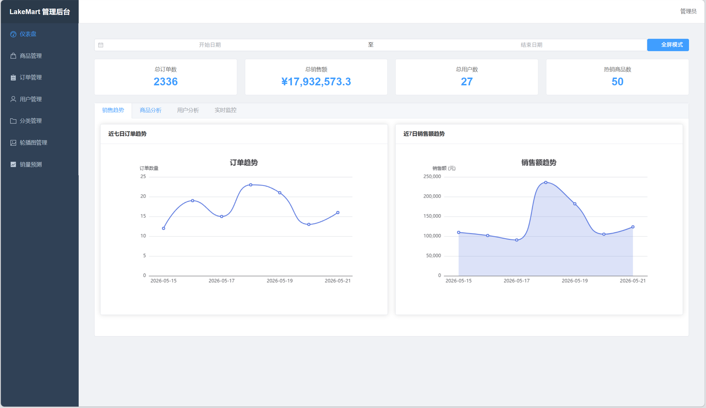 | 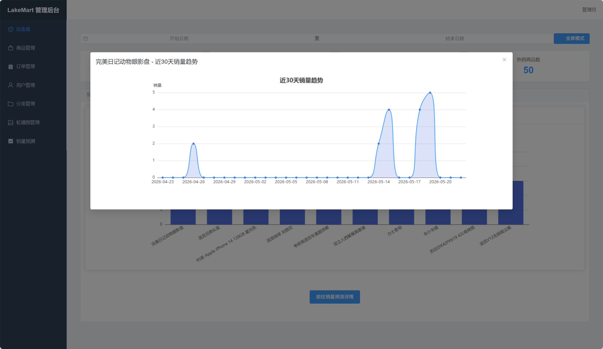 |

| 用户分析 | 实时监控 |
|----------|----------|
| 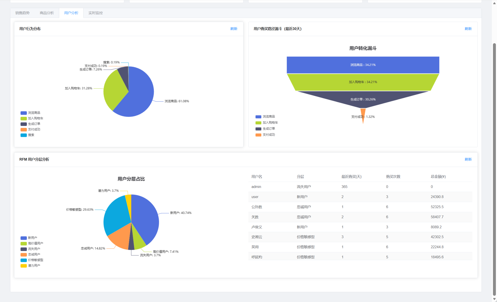 | 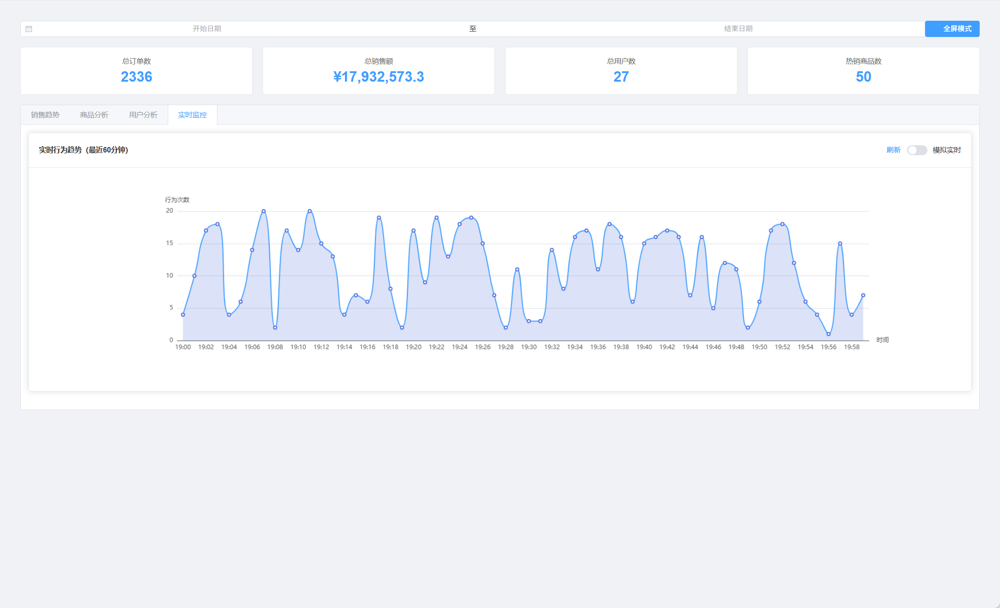 |

| 销量预测（AI 分析） |
|--------------------|
| 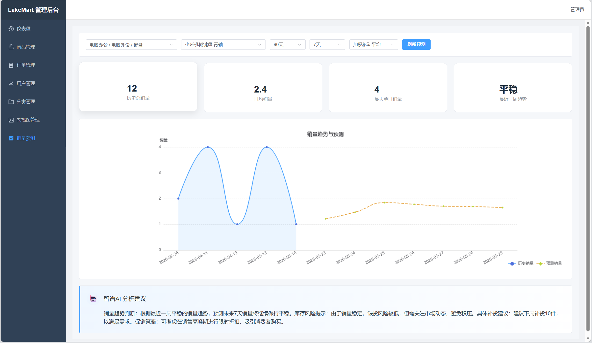 |

#### 基础管理功能

| 功能模块 | 截图 |
|---------|------|
| 商品管理 | 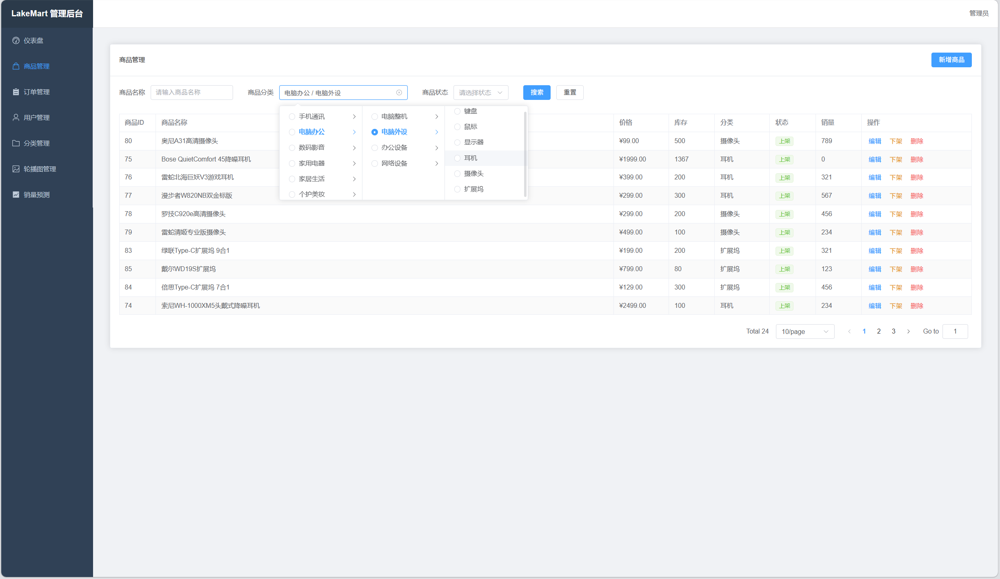 |
| 商品分类 | 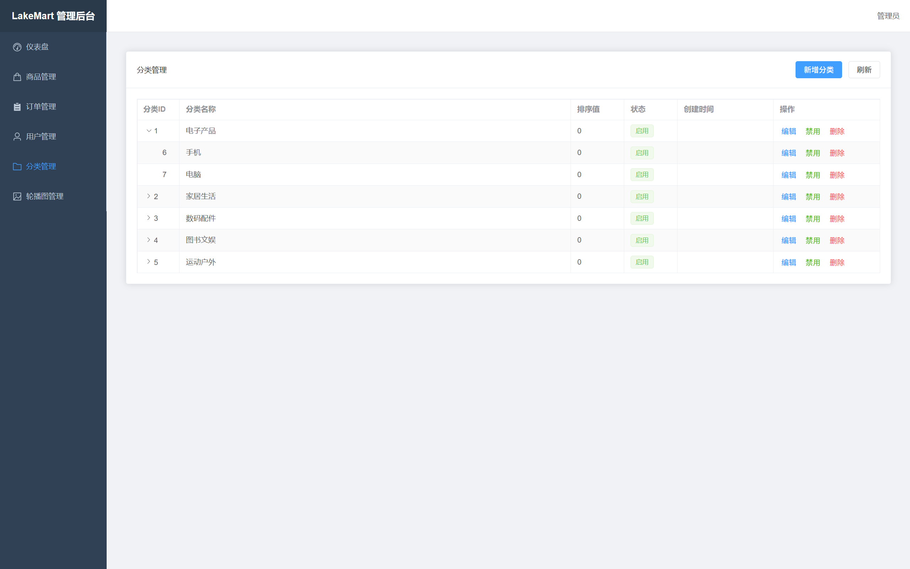 |
| 订单管理 | 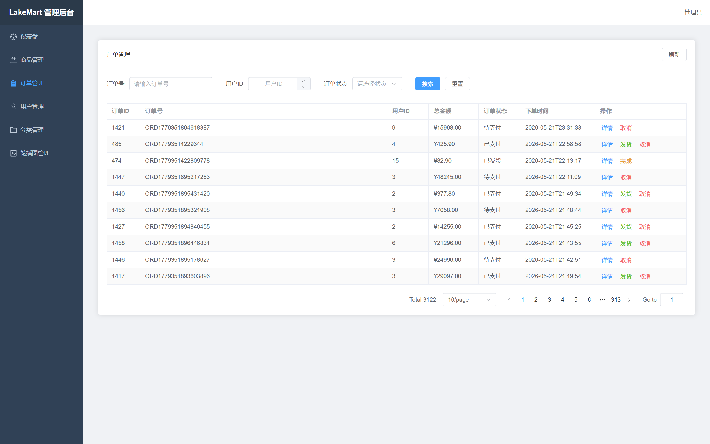 |
| 用户管理 | 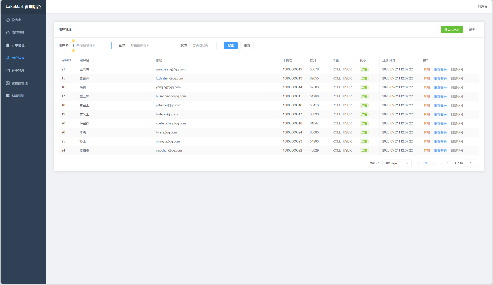 |
| 轮播图管理 | 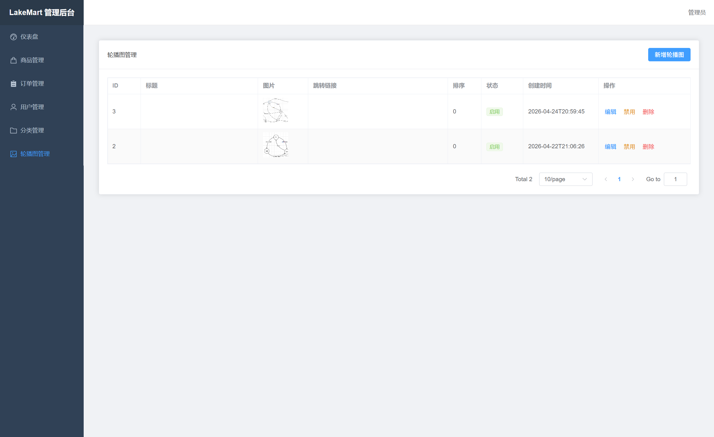 |

### 用户端

| 功能模块 | 截图                                    |
|---------|---------------------------------------|
| 首页 | 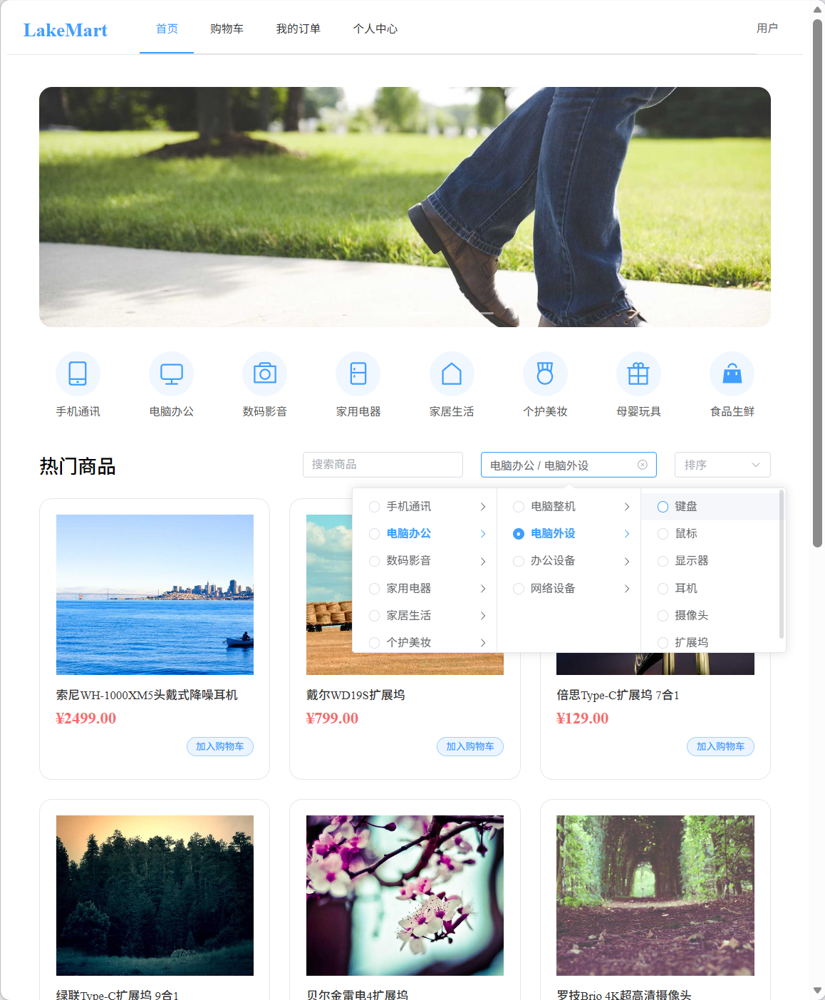       |
| 商品加入购物车 | 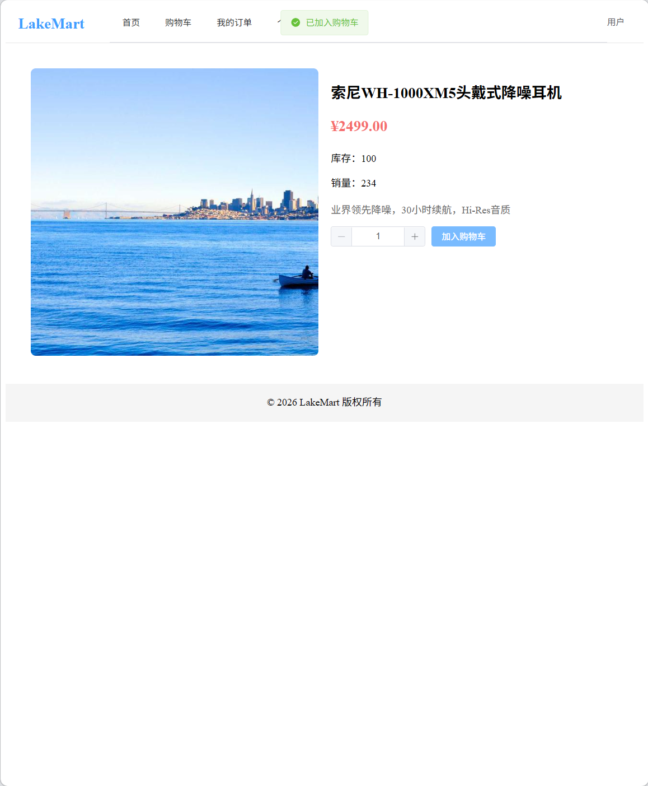 |
| 购物车界面 | 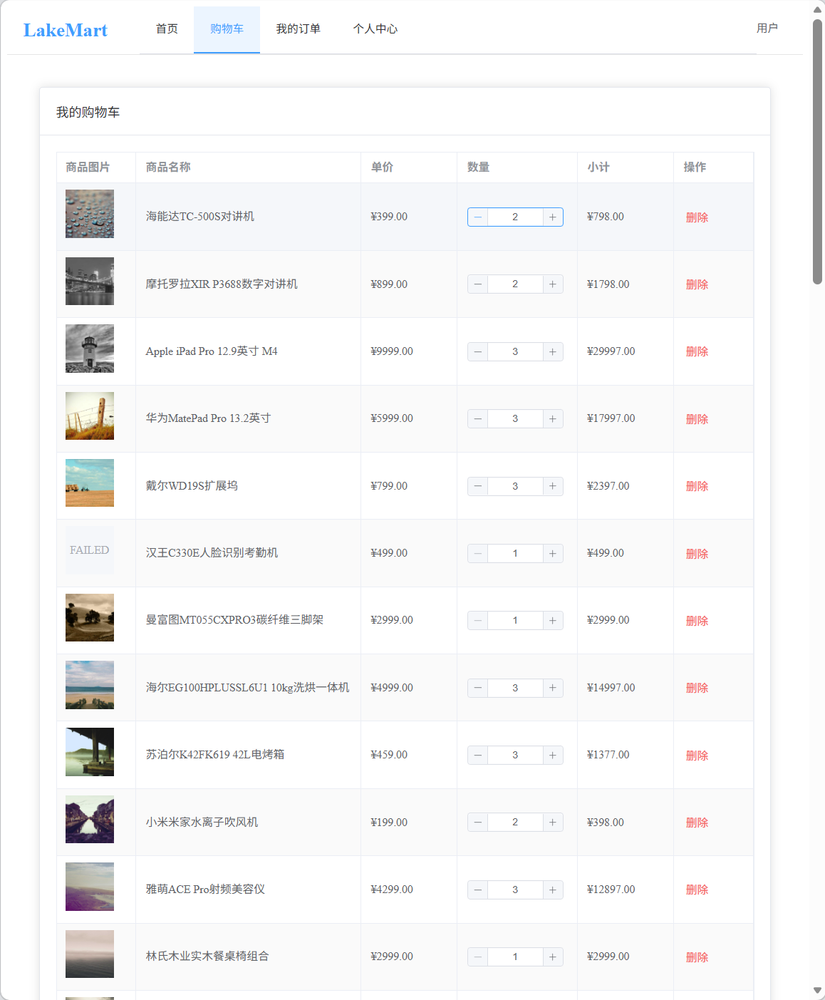 |
| 购物车操作（增删改） | 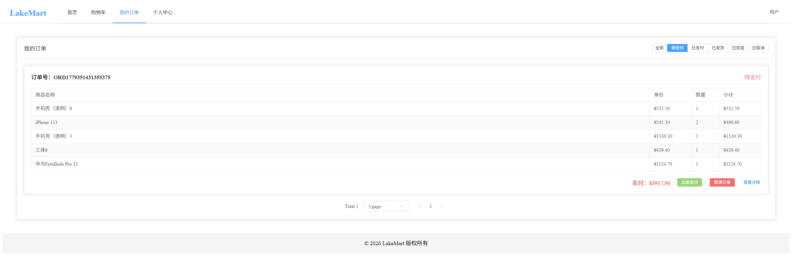 |
| 我的订单 | 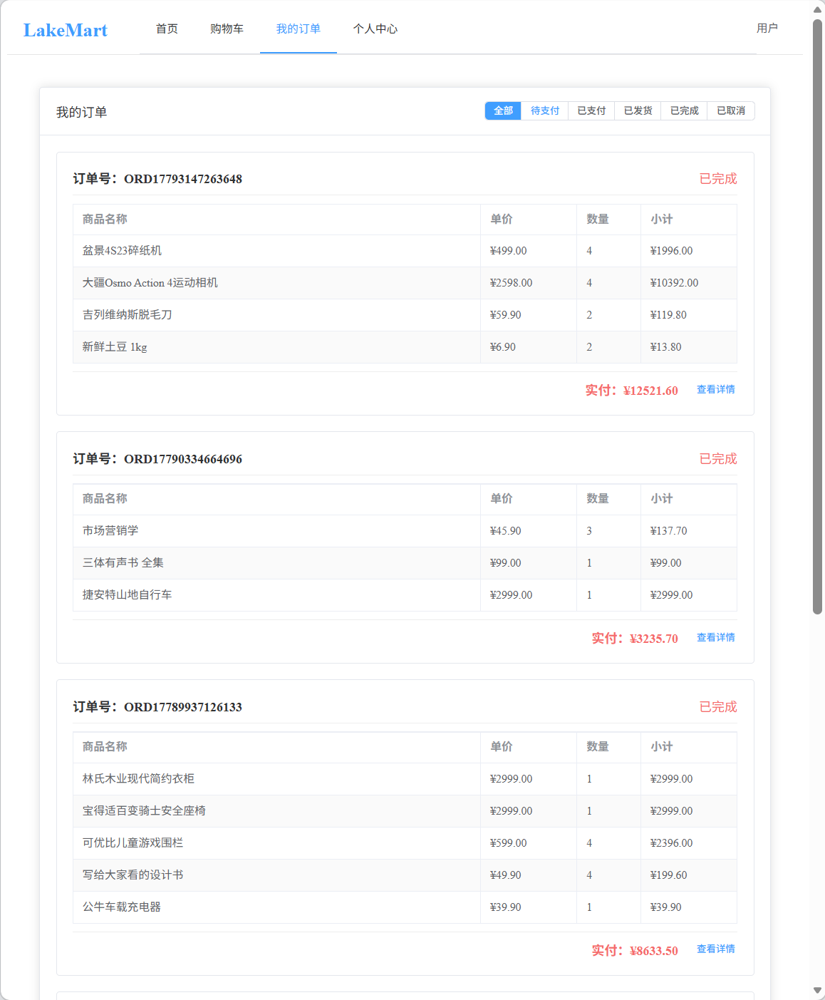   |
| 个人中心 | 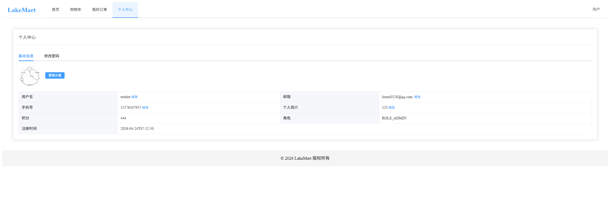   |
## 🤝 贡献指南

欢迎提交 Issue 和 Pull Request。请确保代码风格统一，并遵循现有目录结构。

## 📄 许可证

MIT License © 2026 [sunkuizhi](https://github.com/sunkuizhi)
